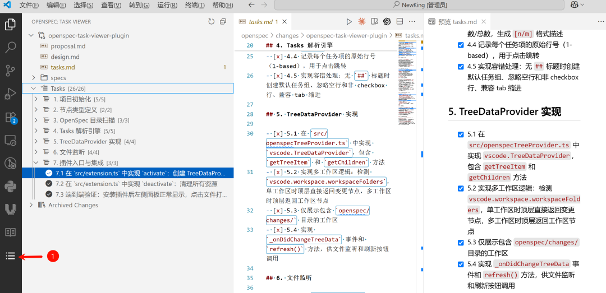
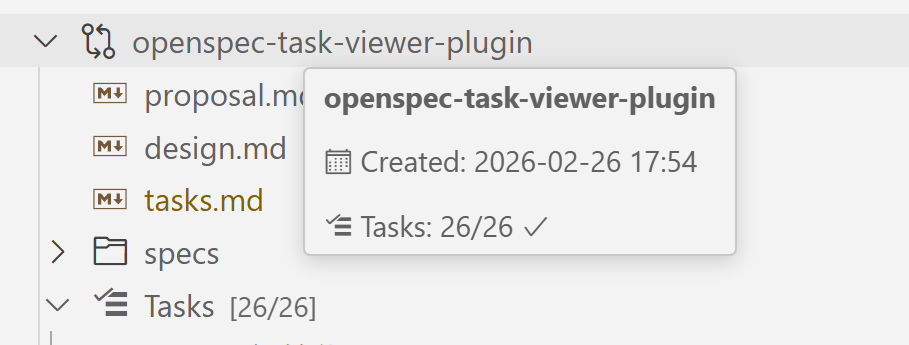

# OpenSpec Task Viewer

**English** | [中文](README_CN.md)

A Visual Studio Code extension that visualizes [OpenSpec](https://github.com/openspec) changes, documents, and task progress in the sidebar.

> `install` : [vscode market](https://marketplace.visualstudio.com/items?itemName=e1roy.openspec-task-viewer)

## What is it?

**OpenSpec Task Viewer** adds an **OpenSpec** panel to the VS Code Activity Bar. It scans the `openspec/changes/` directory in your workspace and presents all change proposals, their documents, and task checklists as an interactive tree view.

You can browse proposals, designs, specs, and track task completion — all without leaving the editor.


## Screenshots

| Plugin Overview | Hover Info |
|:---:|:---:|
|  |  |

## Features

- **Change List** — Scans `openspec/changes/` and displays each change as a tree node
- **Document Preview** — Click `proposal.md`, `design.md`, `tasks.md`, etc. to open Markdown preview
- **Task Progress** — Parses Markdown checkboxes (`- [x]` / `- [ ]`) and shows `[n/m]` completion stats
- **Nested Task Tree** — Supports arbitrarily nested checkbox hierarchies with indent-based parent-child relationships
- **Jump to Line** — Click a task item to jump to the exact line in `tasks.md` and open a side-by-side Markdown preview
- **Archived Changes** — Changes under `archive/` are grouped separately as "Archived Changes"
- **Multi-Workspace Support** — Groups by workspace folder when multiple folders are open; collapses for single workspace
- **Live File Watching** — Monitors `openspec/**` for file changes and auto-refreshes the tree (300ms debounce)
- **Manual Refresh** — Refresh button available in the tree view title bar
- **Theme Adaptive** — Uses native VS Code ThemeIcons/Codicons, works with any light/dark theme

## Tree View Structure

```
OpenSpec (Activity Bar)
└── Task Viewer
    ├── openspec-task-viewer-plugin        ← Active change
    │   ├── proposal.md
    │   ├── design.md
    │   ├── tasks.md
    │   ├── specs/
    │   │   ├── file-watcher
    │   │   ├── multi-workspace
    │   │   ├── task-parser
    │   │   └── tree-view-panel
    │   └── Tasks [20/20]                  ← Task summary
    │       ├── 1. Project Setup [5/5]
    │       │   ├── ✅ 1.1 Create directory ...
    │       │   └── ...
    │       └── ...
    └── Archived Changes
        └── 2026-02-26-origin-clash-...    ← Archived change
```

## Usage

### Install from VSIX

1. Download the `.vsix` file from the [Releases](https://github.com/user/openspec-task-viewer/releases) page
2. In VS Code, open the Command Palette (`Ctrl+Shift+P` / `Cmd+Shift+P`)
3. Run **Extensions: Install from VSIX...** and select the downloaded file
4. The extension activates automatically when your workspace contains an `openspec/changes/` directory

### Usage

- Click the **OpenSpec** icon in the Activity Bar to open the panel
- Expand a change node to view its documents and task progress
- Click any `.md` file to open a Markdown preview
- Click a task item to jump to the corresponding line in `tasks.md`
- Use the refresh button (↻) in the panel title to manually refresh

## Build from Source

### Prerequisites

- [Node.js](https://nodejs.org/) (v18+)
- [npm](https://www.npmjs.com/)
- [Visual Studio Code](https://code.visualstudio.com/) (v1.74.0+)

### Steps

```bash
# Clone the repository
git clone https://github.com/user/openspec-task-viewer.git
cd openspec-task-viewer

# Install dependencies
npm install

# Compile TypeScript
npm run compile

# Package as VSIX (requires vsce)
npx @vscode/vsce package
```

### Development

```bash
# Watch mode — auto-recompile on changes
npm run watch
```

Then press `F5` in VS Code to launch the **Extension Development Host** for debugging.

## Project Structure

```
src/
├── extension.ts              # Entry point: activate / deactivate
├── nodes.ts                  # TreeItem subclasses (10 node types)
├── openspecScanner.ts        # Scans openspec/changes/ directory
├── openspecTreeProvider.ts   # TreeDataProvider implementation
├── taskParser.ts             # Parses tasks.md checkboxes
└── watcher.ts                # FileSystemWatcher with debounce
```

## Requirements

- VS Code `^1.74.0`
- A workspace containing an `openspec/changes/` directory

## License

MIT
